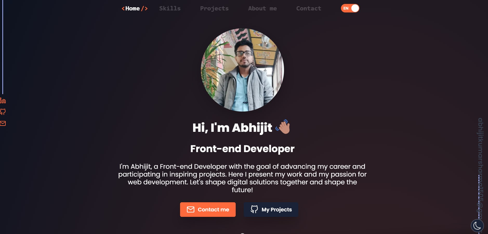

# Portfolio Webseite

This is a portfolio website built using React, Tailwind CSS, and TypeScript. The website showcases my skills and projects as a full-stack developer. For the contactform i used a backend, which is build on node.js and express.

## Demo

You can also check out the live demo of the portfolio website [here](https://portfolio1-mztr.onrender.com/).

## Features

- SEO optimized
- User settings stored in session storage
- Dark and Light mode available
- Easy data modification through a single `data.tsx` file
- Gziped and lazy loaded Data
- Developed first with the Mobile First methodology, then for desktop.
- Compatible with all mobile devices and with a beautiful and pleasant user interface.
- Smooth scrolling in each section.Contains animations when scrolling.
- Uptime Service with colored animation
